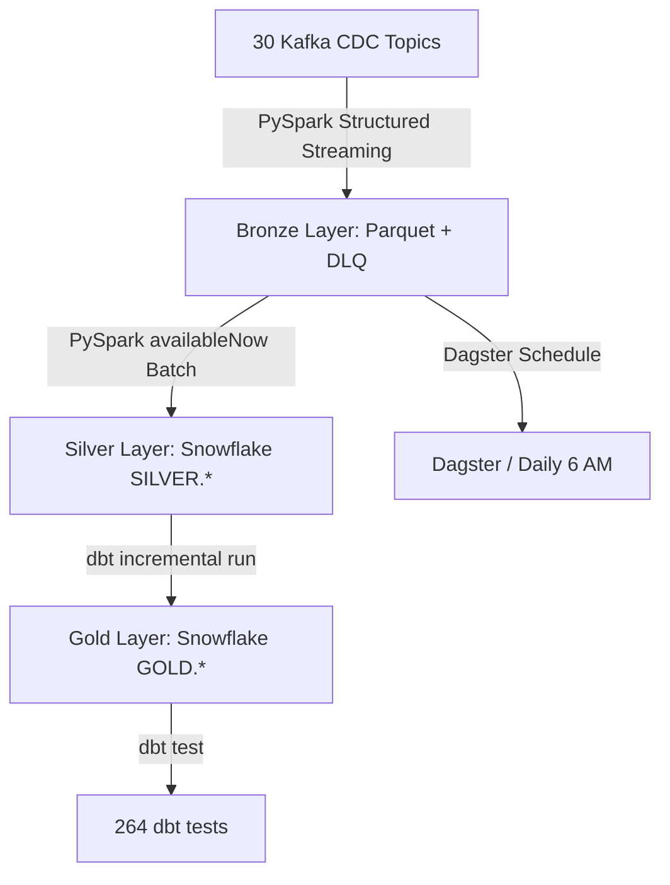

# RetailCortex Project Context & Architecture Map

This document serves as the high-level technical map for the **RetailCortex** project. It outlines the architecture, data flows, implementation status, and known vulnerabilities.

---

## 1. Project High-Level Architecture
RetailCortex is a retail intelligence platform that processes e-commerce data using a **Medallion Architecture** (Bronze → Silver → Gold) across 30 entities:

*   **Ingestion (Bronze):** PySpark Structured Streaming consumes CDC events from 30 Kafka topics, validates JSON against typed schemas, and writes raw payloads as date-partitioned Parquet. Parse failures route to a dead letter queue (DLQ).
*   **Transformation (Silver):** PySpark batch processing (`availableNow` trigger) reads Bronze Parquet, applies cleansing, type casting, and enrichment, then upserts into Snowflake `SILVER` schema tables via merge key. Transform failures route to a Silver DLQ.
*   **Modeling (Gold):** dbt compiles SQL transformations to build 24 dimensional models (9 dims + 8 facts + 7 analytics) in Snowflake `GOLD` schema. Incremental merge strategy for most models, full refresh for analytics aggregations.



---

## 2. Directory & Artifact Map

```
c:\Project\RetailCortex\
├── README.md                           # Project description with architecture + CI badges
├── config/
│   ├── kafka.yaml                      # Kafka bootstrap servers and 30 topic mappings
│   └── snowflake.yaml                  # Snowflake warehouse, database, schema, role
├── data/
│   ├── bronze/{entity}/                # Raw Parquet per entity (date-partitioned)
│   ├── checkpoints/{entity}/           # Spark streaming checkpoints
│   └── dead_letter/{bronze|silver}/{entity}/  # Parse/transform failures
├── src/
│   ├── bronze/                         # 30 entity runners + generic runner.py
│   │   ├── runner.py                   # Generic streaming Bronze runner
│   │   ├── customer.py                 # Per-entity entry point
│   │   └── ...                         # 28 more entities
│   ├── silver/                         # 30 entity runners + generic runner.py
│   │   ├── runner.py                   # Generic Silver batch runner
│   │   ├── customer.py                 # Per-entity transform + runner call
│   │   └── ...                         # 28 more entities
│   ├── schemas/                        # 30 entity schemas (StructType)
│   │   ├── customer_schema.py          # Source + Bronze schema definitions
│   │   └── ...                         # 29 more schema files
│   └── common/                         # Reusable infrastructure
│       ├── config.py                   # YAML + .env configuration loaders
│       ├── dlq.py                      # Bronze + Silver dead letter queue writers
│       ├── logger.py                   # Structured logging
│       ├── paths.py                    # Path generation (bronze, checkpoint)
│       ├── reader.py                   # Kafka stream + Parquet readers
│       ├── settings.py                 # Settings singleton
│       ├── spark.py                    # Spark session builder (Kafka + Snowflake jars)
│       └── writer.py                   # Parquet stream + Snowflake batch writer
├── dbt_retail/                         # dbt project for Gold layer
│   ├── dbt_project.yml                 # Silver (view) + Gold (table) materialization
│   ├── models/
│   │   ├── silver/sources.yml          # 30 source tables with freshness checks
│   │   └── gold/                       # 24 SQL models + 23 YAML configs
│   ├── macros/
│   │   ├── generate_schema_name.sql    # Custom schema resolution
│   │   └── incremental_filter.sql      # Reusable incremental WHERE clause
│   └── packages.yml                    # dbt_date, dbt_utils
├── dagster/
│   └── definitions.py                  # dbt assets + daily 6 AM schedule
├── tests/                              # 152 pytest unit tests
│   ├── conftest.py
│   ├── test_config.py
│   ├── test_paths.py
│   ├── test_schemas.py
│   └── test_settings.py
├── run_pipeline.py                     # Orchestrator: bronze → silver → dbt
├── Makefile                            # Pipeline, lint, test, security targets
└── .github/workflows/ci.yml           # CI: ruff → pytest → dbt run → dbt test → docs deploy
```

---

## 3. Core Component Contexts

### A. Configurations
*   **Kafka (`config/kafka.yaml`):**
    *   `bootstrap_servers`: `localhost:9092` (hardcoded — needs SSL/SASL for production)
    *   `topics`: 30 topic mappings in `telemetry.ecommerce.*` namespace
*   **Snowflake (`config/snowflake.yaml`):**
    *   `warehouse`: `COMPUTE_WH`
    *   `database`: `RETAIL_DB`
    *   `schema`: `SILVER`
    *   `role`: `RETAIL_ETL_ROLE` (least-privilege naming)
*   **Environment Variables (`.env`):**
    *   Required: `SNOWFLAKE_URL`, `SNOWFLAKE_USER`, `SNOWFLAKE_PASSWORD`

### B. PySpark Schemas (`src/schemas/`)
Each entity defines two schemas:
1. **`{ENTITY}_SCHEMA`** — matches the Kafka JSON payload (all fields as StringType to handle raw CDC)
2. **`{ENTITY}_BRONZE_SCHEMA`** — extends source schema with Kafka metadata: `kafka_key`, `topic`, `partition`, `offset`, `ingestion_timestamp`, `ingestion_date`

String-typed datetime and boolean fields are cast to proper types in the Silver transform.

### C. Pipeline Implementation Summary
1.  **Bronze Ingestion (`src/bronze/runner.py`):**
    *   Spark session with Kafka/Snowflake connectors
    *   Reads Kafka stream from entity-specific topic
    *   Parses JSON `value` using `{ENTITY}_SCHEMA`
    *   Per micro-batch: splits into good (Parquet) and bad (DLQ), partitioned by `ingestion_date`
    *   Checkpointed for exactly-once semantics
2.  **Silver Transformation (`src/silver/runner.py`):**
    *   Reads Bronze Parquet stream with `{ENTITY}_BRONZE_SCHEMA`
    *   Applies per-entity `transform_func` (type casting, normalization, enrichment)
    *   Writes to Snowflake via merge upsert (`mergeKey`)
    *   `trigger(availableNow=True)` — processes all available data then stops
    *   Failed batches routed to Silver DLQ

### D. dbt Layer Context (`dbt_retail/`)
*   **`dbt_project.yml`**: Silver → view (schema: `silver`), Gold → table (schema: `gold`)
*   **`models/silver/sources.yml`**: 30 source tables with freshness checks (warn: 2h, error: 6h) on `ingestion_timestamp`
*   **Gold models (24 total):**
    *   9 dimensions — incremental merge with surrogate keys
    *   8 facts — incremental merge with surrogate keys referencing dimensions
    *   7 analytics — full refresh table (customer_360, product_performance, etc.)
*   **264 dbt tests** run in CI covering `not_null`, `unique`, `accepted_values`
*   **Missing:** `relationships` tests for foreign keys, `dim_dates.yml` (added in v0.3.0)

---

## 4. Known Vulnerabilities (To Be Remedied)
1.  **No Secrets Management:** Snowflake credentials stored in plaintext `.env` file. No vault integration.
2.  **No Kafka Security:** Unsecured connection — no SSL/SASL configured.
3.  **Local Storage Reliance:** All Spark paths bound to local directories via `PROJECT_ROOT = Path.cwd()`, no cloud storage support.
4.  **No SCD Type 2:** Gold dimensions overwrite incrementally (Type 1) without preserving history.
5.  **Silver DLQ Batch Failure:** A single bad record sends the entire micro-batch to DLQ — no per-record error handling.
6.  **No Data Retention:** Bronze Parquet + DLQ files grow unboundedly — no TTL or purge policy.
7.  **Incomplete dbt Test Coverage:** ~70% of gold columns tested, zero `relationships` tests on foreign keys.
8.  **Stale docs/architecture.md:** Previously referenced `ACCOUNTADMIN` role (fixed in config, doc now updated).
